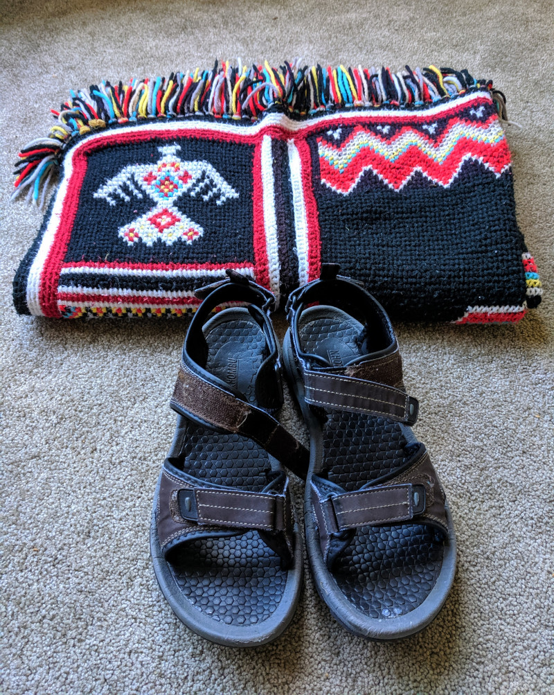

Recently I have been impressed with the worldview of the <a href="https://www.youtube.com/watch?v=vrzESek2B2E" target="_blank" rel="noopener">minimalism</a> or voluntary simplicity movement. This is a lifestyle that advocates stripping away cruft to the point that you retain just what's truly core to your heart and your life purposes. Minimalism's proponents are known for eliminating physical clutter or living in tiny houses, but the streamlining is broader, including how we fill our minds, our time, and our dinner plates.

I see strong resonance between minimalism and other things I value:
<ul>
	<li>The church's recent <a href="https://www.lds.org/general-conference/2019/04/35oaks?lang=eng" target="_blank" rel="noopener">emphasis on simplifying and distilling</a>. Jesus's <a href="https://www.lds.org/scriptures/nt/luke/9.58?lang=eng&clang=eng#p57" target="_blank" rel="noopener">comment</a> that foxes had holes and birds had nests, but he had almost nothing. The lifestyle I lived as a missionary. Elder Bednar's comments about <a href="https://www.lds.org/general-conference/2018/10/gather-together-in-one-all-things-in-christ?lang=eng" target="_blank" rel="noopener">unifying everything into a singular focus on Christ</a>.</li>
	<li>Several business books that advocate a rejection of multitasking, and a "<a href="https://www.franklincovey.com/the-7-habits/habit-2.html" target="_blank" rel="noopener">begin with the end in mind</a>" or "<a href="https://www.ted.com/talks/simon_sinek_how_great_leaders_inspire_action?language=en" target="_blank" rel="noopener">start with why</a>" focus that is singular and razor sharp.</li>
	<li>The sort of lifestyle practiced by Gandhi, Mother Teresa, and others who gave great service without distraction.</li>
	<li>The ethos of being kind to the earth and its creatures. Avoiding <a href="https://youtu.be/9GorqroigqM" target="_blank" rel="noopener">hollow consumerism, waste, and pollution</a>. Living off the grid. <a href="https://www.youtube.com/watch?v=eHJiNC_7wuw" target="_blank" rel="noopener">Eating local and vegetarian</a>. Being self-sufficient.</li>
</ul>
I talked this over with Linda. I have decided that I am going to make serious efforts to minimize. I believe Linda feels aligned and eager to do the same, though she will of course approach it in her own way. (Minimalists say that everybody's definition of what is core will be different, which suggests to me that as we jettison layers of irrelevance, the individual talents and interests that make us unique shine brighter. This is going to be a fun adventure of self discovery for us.)

When people go on a diet or quit smoking, they tell as many people as possible about the change, so they can get support and feel accountable to others. So I'm sending you this note to announce my intentions and ask that of you.

One way you can help me is to accept a new mindset I am adopting toward gifts, keepsakes, and hand-me-downs. The mindset could be summarized as: on giving occasions, what I will value most will be a phone call, a letter, a hug, a memory, a photo, a poem, or a shared experience with you, and not so much something tangible or monetary. Since I will be trying not to have extra pairs of socks and ties and books around, such things will be harder for me to fit into my minimizing strategy. And I probably won't take you up on most offers of free clothes or furniture. I'm more or less a dieter hoping his friends don't offer him dessert very often. :-)

I won't be totally rigid about this; I couldn't stand that. A few of the things I own are tangible gifts that are incredibly precious. For example, I own a beautiful afghan that my mom created for me over a period of many months, at great effort. I vividly remember her counting loops on it in evening hours during some dark and cold winter evenings. I sleep with it in the winter, sometimes, and I will never voluntarily part with it. I also own a pair of sandals that I inherited from my father-in-law; they are my favorite pair of shoes and I will wear them until they fall apart. By stripping away the possessions that don't reach this high bar of tenderness for me, I am trying to pay greater honor to what's special about the few that remain.

I hope this doesn't bother you, or strike you as selfish. I won't be prickly or ungrateful if you give me something tangible, and I plan to continue my current gift-giving habits toward you, unless you tell me otherwise. I just feel like I need to try hard to make a sea change in the way I think about possessions.

I would love encouragement and questions as I embark on this experiment.